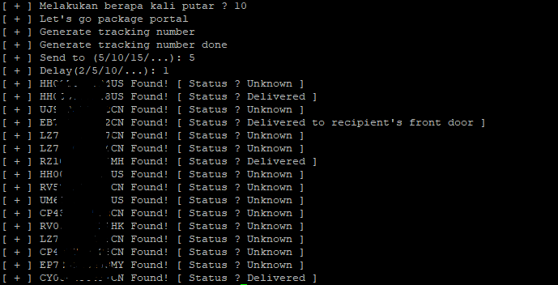

# GtrackingNumb
Generate Tracking number & Validation delivered

[]()
[]()

Get a reference from the comments on the website to check the tracking number i.e. track24 & do the validation via the ship24.com API.

### How to ?
```
$ git clone https://github.com/shdax/GtrackingNumb.git
$ cd GtrackingNumb
$ chmod +x go.sh
$ ./go.sh
```



### Support
<a href="https://track24.net/">https://track24.net/</a>

<a href="https://ship24.com/">https://ship24.com/</a>
